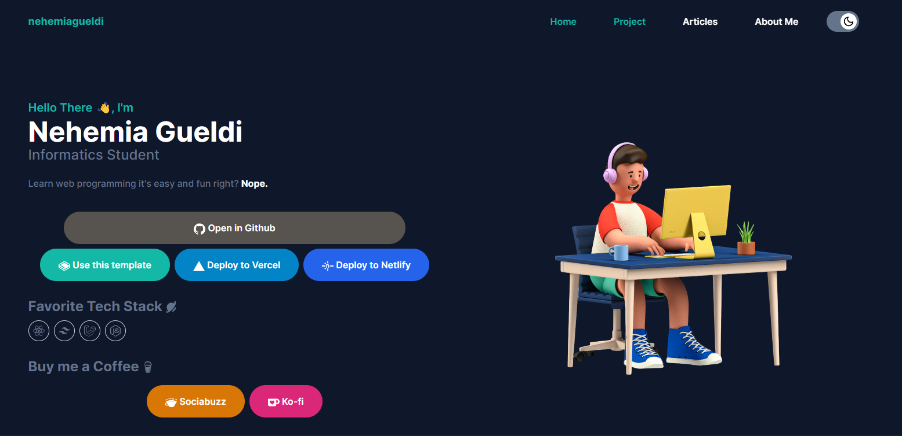

# Portfolio HTML + TailwindCSS Starterpack

This is a Portfolio HTML + TailwindCSS Starterpack is a pre-built template that combines the power of HTML and the flexibility of the TailwindCSS framework to create a stylish and responsive portfolio website. This is a ready-to-use website template that can help you showcase your work and skills in a visually appealing and professional manner. It's a great starting point for creating your own portfolio website without the need for extensive coding knowledge.

It's a fantastic toolkit I've created to help you kickstart your own portfolio website with ease. This starterpack combines the power of HTML and the flexibility of TailwindCSS, making it a perfect choice for both beginners and experienced developers.

With this starterpack, you don't need to start from scratch or spend hours on complex setups. I've carefully crafted a ready-to-use template that's fully customizable and designed to showcase your work beautifully.


## What's included here?

- Portfolio or project showcase : Highlights the creator's work, such as artwork, designs, or projects.
- Contact form : Enables visitors to send messages or inquiries to the website owner.
- Social media integration : Links to social media profiles.
- About section : Provides information about the website owner, their background, or purpose.
- Article section : a common feature found on many websites, especially those that focus on providing informative content or news. 
- Light/Dark mode toggle
- Full Responsive
- Available to Deploy (Vercel or Netlify for free)


## Run Locally

**Start the Tailwind CLI build process**

Run the CLI tool to scan your template files for classes and build your CSS.

```bash
  npx tailwindcss -i ./src/input.css -o ./dist/output.css --watch
```


## Deployment

- **Deploy to Vercel**

[](https://vercel.com/import/git?s=https://github.com/nehemiagueldi/portfolio-html-tailwindcss-nehemiagueldi)


- **Deploy to Netlify**

[](https://app.netlify.com/start/deploy?repository=https://github.com/nehemiagueldi/portfolio-html-tailwindcss-nehemiagueldi)

## 📚 References

[**TailwindCSS**](https://tailwindcss.com/)


## ☕ Buy me a coffee

[](https://ko-fi.com/nehemiagueldi)

[](https://sociabuzz.com/nehemiagueldi/donate)


## 🔗 Links

[](https://github.com/nehemiagueldi)

[](https://www.linkedin.com/in/nehemiagueldi/)

[](https://nehemiagueldi.github.io/) 


